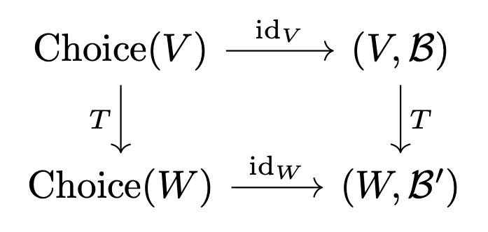
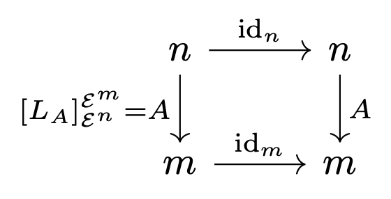
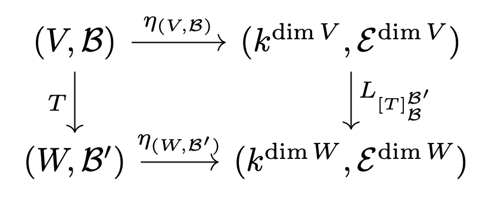

# FinDimVect = BasisVect = Mat

이 문서의 내용은 \[Riehl16\]의 30쪽을 참고했다.

## 정의

### 범주

${ \mathsf{Vect}^{\mathrm{fd}}_{k} }$: 체 ${ k }$ 위의 유한차원 벡터공간들의 범주

${ \mathsf{Vect}^{\mathrm{basis}}_{K} }$는 다음과 같이 정의된다:

- 오브젝트: 유한차원 벡터공간 ${ V }$와 그 기저 ${ \mathcal{B} }$의 순서쌍 ${ (V,\mathcal{B}) }$
- ${ \operatorname{Hom}\left( \left( V,\mathcal{B} \right),\left( W,\mathcal{B'} \right) \right) }$: ${ V }$에서 ${ w }$으로 가는 모든 선형사상들의 모임

${ \mathsf{Mat}_{k} }$는 다음과 같이 정의된다:

- ${ \operatorname{Ob}(\mathsf{Mat}_{k}) = \mathbb{N} }$
- ${ \operatorname{Hom}(n,m) }$: 체 ${ k }$ 위의 모든 ${ m\times n }$ 행렬들의 모임

### 함자

$$ \mathsf{Vect}_{k}^{\mathrm{fd}}\underset{\operatorname{Forget}}{\overset{\operatorname{Choice}}{\rightleftarrows}} \mathsf{Vect}_{k}^{\mathrm{basis}}\underset{k^{(-)}}{\overset{\operatorname{Repr}}{\rightleftarrows}} \mathsf{Mat}_{k} $$

#### 기저 선택 함자 Choice

$$ \operatorname{Choice}(V\overset{T}{\to} W) = (V,\mathcal{B}) \overset{T}{\to} (W,\mathcal{B}')$$

#### 행렬 표현 함자 Repr

$$ \operatorname{Repr}((V,\mathcal{B}) \overset{T}{\to} (W,\mathcal{B}')) = \dim V \overset{[T]_{\mathcal{B}}^{\mathcal{B'}}}{\to} \dim W $$

#### 좌표 표현 함자 k(-)

$$ k^{(n \overset{A}{\to}m)} = (k^{n},\mathcal{E}^{n}) \overset{L_{A}}{\to} (k^{m},\mathcal{E}^{m}) $$

여기서 ${ L_{A} }$는 좌측곱 ${ L_{A}(X) = AX }$이고 ${ \mathcal{E}^{n} }$은 ${ k^{n} }$의 표준기저.

#### 망각 함자 Forget

$$ \operatorname{Forget}((V,\mathcal{B}) \overset{T}{\to} (W,\mathcal{B}')) = V \overset{T}{\to} W $$

## 명제

**Proposition** ${ \mathsf{Vect}_{k}^{\mathrm{fd}} \simeq \mathsf{Vect}_{k}^{\mathrm{basis}} \simeq \mathsf{Mat}_{k} }$

**Proof)**

(1) ${ \mathsf{Vect}_{k}^{\mathrm{fd}} \simeq \mathsf{Vect}_{k}^{\mathrm{basis}} }$

$$ \operatorname{Forget} \circ \operatorname{Choice} = \operatorname{id}_{\mathsf{Vect}_{k}^{\mathrm{fd}}} $$

이므로

$$ \operatorname{id}_{\mathsf{Vect}_{k}^{\mathrm{fd}}} \simeq \operatorname{Forget} \circ \operatorname{Choice}  $$

${ \alpha: \operatorname{Choice} \circ\operatorname{Forget} \to\operatorname{id}_{\mathsf{Vect}_{k}^{{\mathrm{basis}}}}}$를 ${ \alpha_{(V,\mathcal{B})} = \operatorname{id}_{V} }$으로 잡으면 다음 가환도식을 만족하는 자연동형사상이 된다.

따라서,

$$ \operatorname{Choice} \circ \operatorname{Forget} \overset{\alpha}{\simeq} \operatorname{id}_{\mathsf{Vect}_{k}^{\mathrm{basis}}}  $$

(2) ${ \mathsf{Vect}_{k}^{\mathrm{basis}} \simeq \mathsf{Mat}_{k} }$

${\epsilon_{n} =  \operatorname{id}_{n} }$으로 두면 ${ \epsilon: k^{(-)} \circ \operatorname{Repr} \to \operatorname{id}_{\mathsf{Mat}_{k}} }$는 다음 가환도식을 만족하는 자연동형사상임을 확인할 수 있다.

${ \eta_{(V,\mathcal{B)}}: (V,\mathcal{B}) \to (k^{\dim V},\mathcal{E}^{\dim V}) }$를 다음과 같이 택하자,

$$ \eta_{(V,\mathcal{B})}(v) = \left[ v \right]_{\mathcal{\mathcal{B}}} $$

여기서 ${ \left[ v \right]_{\mathcal{B}} }$는 벡터 ${ v \in V}$의 기저 ${ \mathcal{B} }$에 대한 좌표 표현이다. 그러면,

$$ \left(L_{[T]_{\mathcal{B}}^{\mathcal{B}'}} \circ \eta_{(V,\mathcal{B})}\right)\left( v \right) = [T]_{\mathcal{B}}^{\mathcal{B'}} [v]_{\mathcal{B}} = [Tv]_{\mathcal{B}'} = \left( \eta_{(W,\mathcal{B}')} \circ T \right)\left( v \right) $$

따라서 ${ \eta : \operatorname{id}_{\mathsf{Vect}_{k}^{\mathrm{basis}}} \to \operatorname{Repr} \circ k^{(-)} }$는 자연동형사상이다.

## 참고문헌

\[Riehl16\] [Riehl, Emily](https://en.wikipedia.org/wiki/Emily_Riehl "Emily Riehl") (2016). [_Category Theory in Context_](https://books.google.com/books?id=6B9MDgAAQBAJ). Dover. [ISBN](https://en.wikipedia.org/wiki/ISBN_\(identifier\) "ISBN (identifier)") [9780486809038](https://en.wikipedia.org/wiki/Special:BookSources/9780486809038 "Special:BookSources/9780486809038").